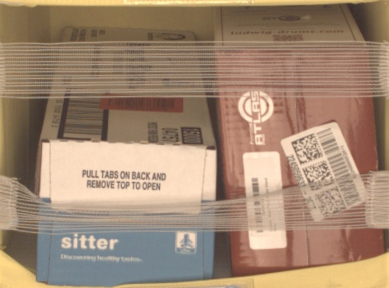
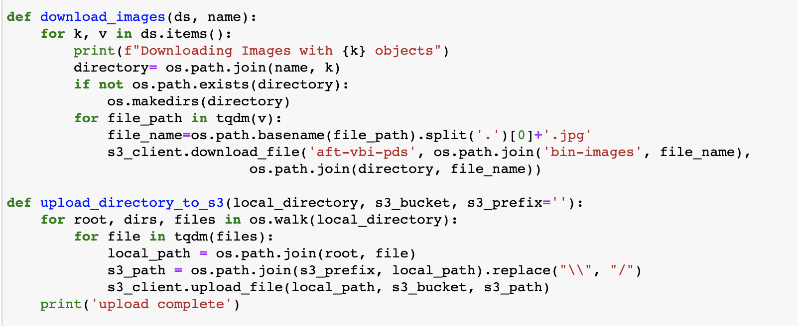
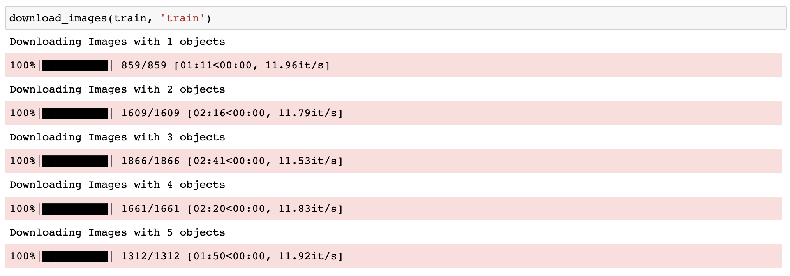
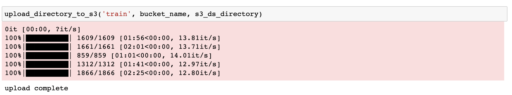

# Inventory Monitoring at Distribution Centers using CNNs

Inventory Monitoring at Distribution Centers is an important task for some companies in charge of delivering packages. When you order something from Amazon they need to make sure that they are delivering all the product items you ordered within a single package, nothing more and nothing less.

This project uses the Amazon Bin Image Dataset that contains images of orders together with the amount of products that are in every order. The dataset contains 500K images but only a subset of them are used here to train a model using ConvNets. The objective of this project is to build a classifier that receives an image of an order with the products in it and it tries to guess how many products there are. Also, this project illustrates mainly how to train/evaluate/deploy a model in Sagemaker to be ready to be used for making predictions via an endpoint.

## Project Set Up and Installation
This project contains the following files and directories:
- `sagemaker.ipynb`: This is the main Jupyter Notebook instance that performs the end-to-end process for obtaining a model.
- `src/*.py`: Here are the files used by the `sagemaker.ipynb` notebook for train, evaluate, and infer.
- `img_tests_pred/*,jpg`: Sample pictures used for making inferences.
- `ProfilerReport/`: It contains the profiler report generated after training.
- `file_list.json`: File containing metadata information about the dataset to be download.

Make sure that you open a notebook instance in Sagemaker and add all of these files before runing the project. Also make sure to chang the bucket name configuration at the top of the script to point to your own bucket.

## Dataset

### Overview
The Amazon Bin Image Dataset contains over 500,000 images and metadata from bins of a pod in an operating Amazon Fulfillment Center. The bin images in this dataset are captured as robot units carry pods as part of normal Amazon Fulfillment Center operations.

The dataset was obtained from <a href="https://registry.opendata.aws/amazon-bin-imagery/">here</a> and it contains images of customer's orders previously to be sent to them. Also contains labeled information about the images such as how many products it has, what the products are, their weights, etc.

The objective of the project is to build a classifier for the images that tells you how many objects it sees.

An image of the dataset containing 2 objects is shown below:



### Access
The dataset is publicly available and it can be accessed either from an S3 bucket or HTTP request.

For accesssing via S3 we can list the files and copy them directly from our notebook:

```
!aws s3 ls s3://aft-vbi-pds/bin-images/
!aws s3 cp s3://aft-vbi-pds/bin-images/523.jpg 523.jpg
```

For accessing via HTTP we can make a request like this for the image and the metadata
```
!wget https://aft-vbi-pds.s3.amazonaws.com/bin-images/523.jpg
!wget https://aft-vbi-pds.s3.amazonaws.com/metadata/523.json
```

The notebook downloads every file from the list `file_list.json` locally and splits them in train, test, and validation datasets before uploading them into a bucket in S3 such as:




## Model Training

The model used is a pretrained **ResNet50** model that uses transfer learning to add the following layers:

- Drop out of 0.25
- Fully Connected Layer: with 2048 neurons
- Fully Connected Layer: with 128 neurons
- Fully Connected Layer (output layer): with 5 neurons one for each class

The model was chossen because it is one of the most ourperformed and popular models for image classification.

Two parameters are tuned: learning rate and batch size. The first one may take any value between 0.001 and 0.1 and the second one may take any of these specific values 32, 64, 128, 256, 512.

The metric used for assess the classifier is the accuracy, defined as follows:

$Accuracy = \frac{Number Of Corrected Predictions}{Total Number Of Predictions}\times 100\%$

After hyperparameter tuning and model training, the best model obtained a Testing Accuracy of 32,41%

## Machine Learning Pipeline

The machine learning pipeline consists on the following steps:

- *Data downloading:* the dataset is downloaded locally and then upload to S3 so it can be used by other instances:
- *Data cleaning:* some of the images presented incorrect annotations of were very blurry so they were deleted from the dataset
- *Data transformation:* the images were resized to 224x224 pixels and rotated randomly before training the model
- *Model Selection:* hyperparameter tuning was performed with 4 jobs and then the best model was selected to be trained.
- *Model Training:* the best model was trained and evaluated
- *Debug and Profiling:* a complete profiler report was obtained with relevant information such as GPU/CPU utilization and debugger information such as training loss was reported.
- *Model Deployment:* it deploys the best model to a Sagemaker endpoint.
- *Model Inference:* once the model is deployed, it can be used to make predictions for different images never seen before.

## Standout Suggestions

In an effort to improve accuracy many things were tested out such as resizing the images to 224x224 instead of 112x112, centering them, croping them, normalizing them, trying data augmentation making a rotation of the images, modifying the architecture to include more or less layers, adding a dropout layer to avoid overfitting, adding early stopping to have the chance to train more hyperparam jobs, etc. Unfortunately, none of these techniques made a lot of improvement in the final model.

This project presented a lot of difficulties to obtain a final-ready-to-use model because the accuracy of the model presented is low and it may not be sufficient to move it to a production-ready environment. Further work needs to be done to have a better model such as the use of more images from the dataset, more experimentation with some other pretrained models, some more architecture, the use of more hyperparameters, etc. Nevertheless, the present project has accomplished its purpose which is show how to have a model togheter to the end-to-end process needed using AWS resources and tools.

